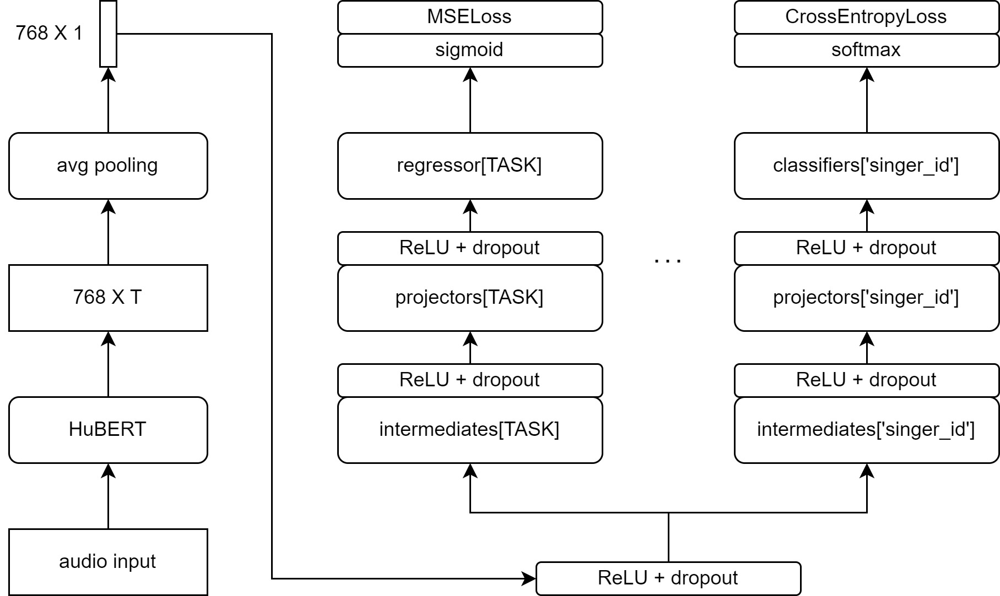
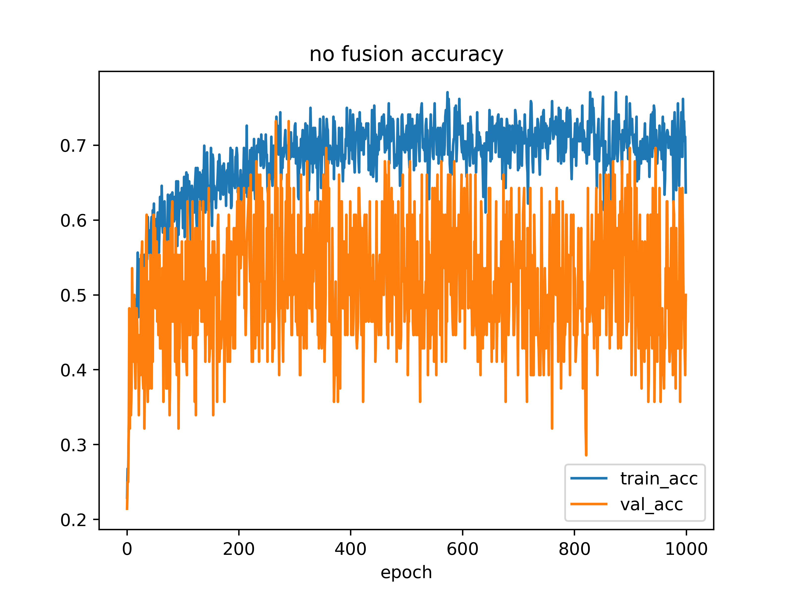
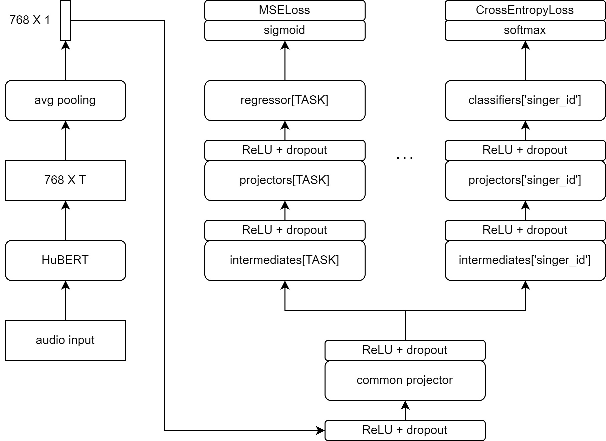
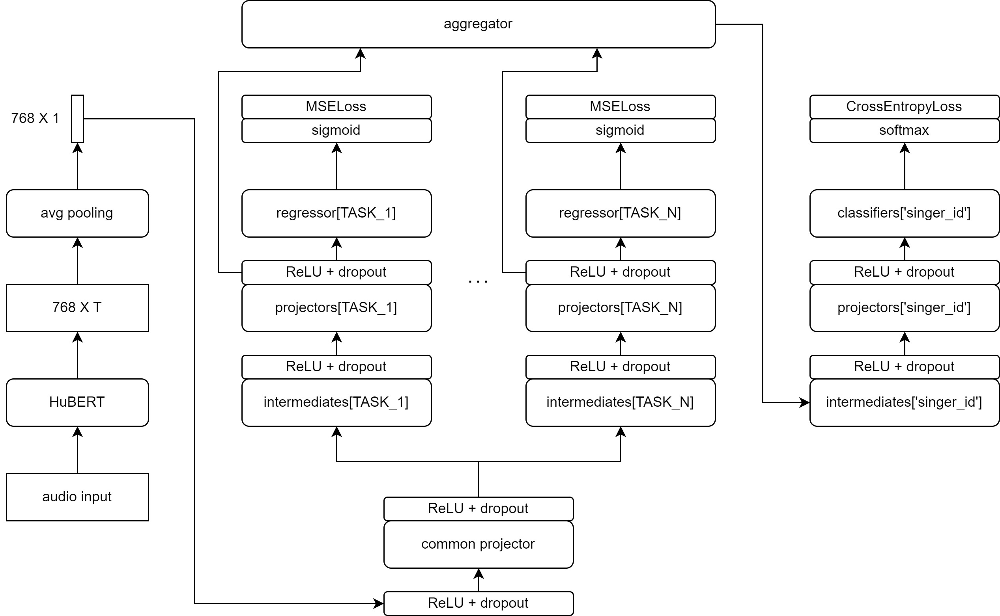
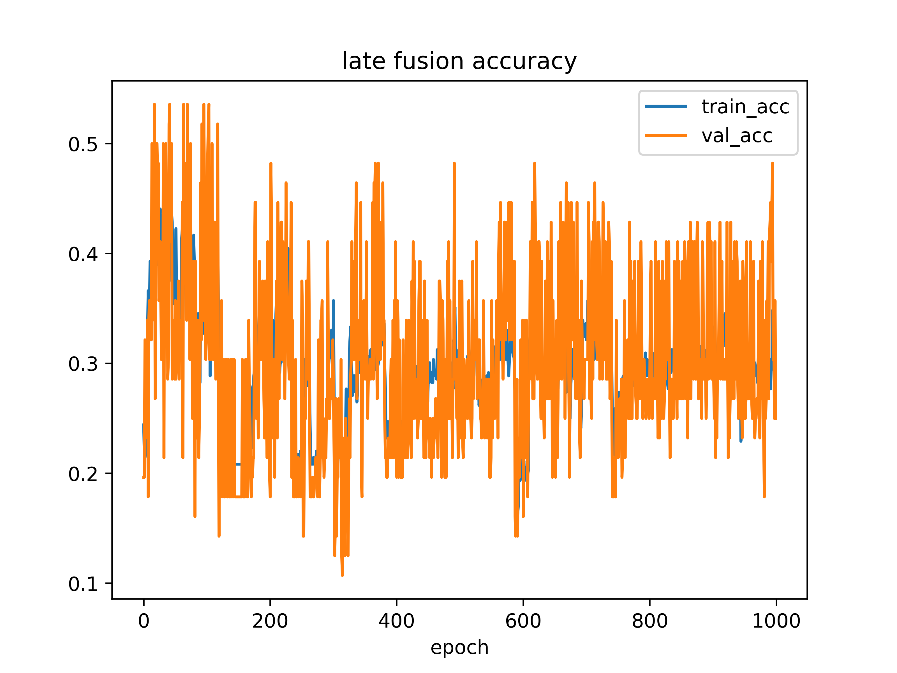

# singer_feature_multi_regression
Applies multiple regression heads to fine tune an audio transformer on multiple downstream regression tasks. The base for all models is a frozer HuBERT model and on top of that, different architectures are tried out.

So far the investigation concerns three architectures (but there seems to be something wrong because results don't make absolute sense):

Baseline singer classification model (no features involved):

No fusion model (feature regression and singer classification are preformed independently):

Early fusion model (feature regression and singer classification have the same trainable base):

Late fusion model (singer classification is based on the projectors of feature regression modules and training occurs jointly):

